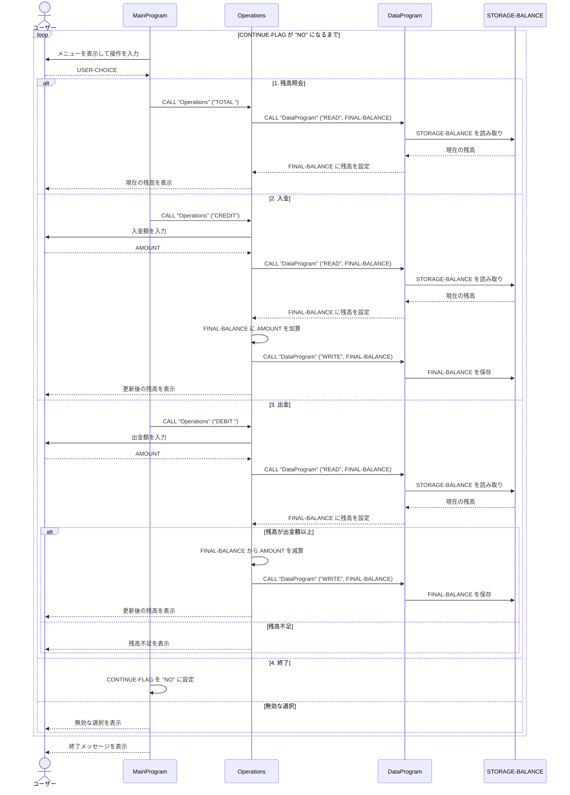

# アプリケーションのデータフロー

```mermaid
sequenceDiagram
    actor User as ユーザー
    participant Main as MainProgram
    participant Operations as Operations
    participant Data as DataProgram
    participant Storage as STORAGE-BALANCE

    loop CONTINUE-FLAG が "NO" になるまで
        Main->>User: メニューを表示して操作を入力
        User-->>Main: USER-CHOICE

        alt 1. 残高照会
            Main->>Operations: CALL "Operations" ("TOTAL ")
            Operations->>Data: CALL "DataProgram" ("READ", FINAL-BALANCE)
            Data->>Storage: STORAGE-BALANCE を読み取り
            Storage-->>Data: 現在の残高
            Data-->>Operations: FINAL-BALANCE に残高を設定
            Operations-->>User: 現在の残高を表示
        else 2. 入金
            Main->>Operations: CALL "Operations" ("CREDIT")
            Operations->>User: 入金額を入力
            User-->>Operations: AMOUNT
            Operations->>Data: CALL "DataProgram" ("READ", FINAL-BALANCE)
            Data->>Storage: STORAGE-BALANCE を読み取り
            Storage-->>Data: 現在の残高
            Data-->>Operations: FINAL-BALANCE に残高を設定
            Operations->>Operations: FINAL-BALANCE に AMOUNT を加算
            Operations->>Data: CALL "DataProgram" ("WRITE", FINAL-BALANCE)
            Data->>Storage: FINAL-BALANCE を保存
            Operations-->>User: 更新後の残高を表示
        else 3. 出金
            Main->>Operations: CALL "Operations" ("DEBIT ")
            Operations->>User: 出金額を入力
            User-->>Operations: AMOUNT
            Operations->>Data: CALL "DataProgram" ("READ", FINAL-BALANCE)
            Data->>Storage: STORAGE-BALANCE を読み取り
            Storage-->>Data: 現在の残高
            Data-->>Operations: FINAL-BALANCE に残高を設定
            alt 残高が出金額以上
                Operations->>Operations: FINAL-BALANCE から AMOUNT を減算
                Operations->>Data: CALL "DataProgram" ("WRITE", FINAL-BALANCE)
                Data->>Storage: FINAL-BALANCE を保存
                Operations-->>User: 更新後の残高を表示
            else 残高不足
                Operations-->>User: 残高不足を表示
            end
        else 4. 終了
            Main->>Main: CONTINUE-FLAG を "NO" に設定
        else 無効な選択
            Main-->>User: 無効な選択を表示
        end
    end
    Main-->>User: 終了メッセージを表示
```
