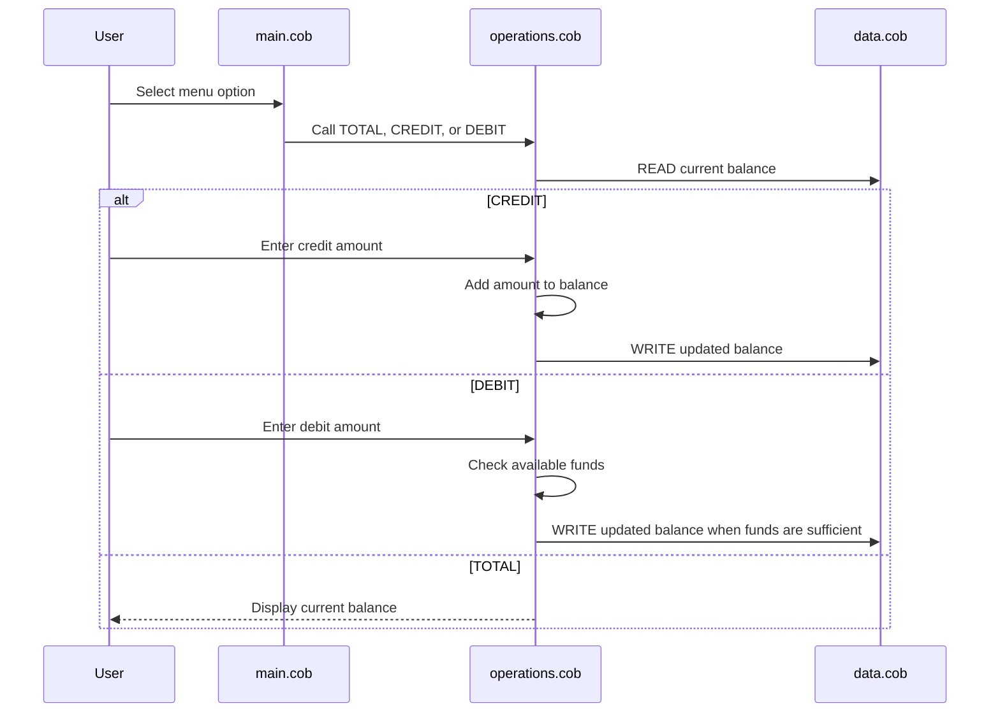

# School Accounting System Overview

This legacy COBOL application manages student account balances for the school.

## File responsibilities

- `main.cob` is the menu-driven entry point. It displays the account management options, accepts the user's choice, and calls the operations program to view the balance, credit an account, debit an account, or exit.
- `operations.cob` contains the business operations for student accounts. It supports `TOTAL` to show the current balance, `CREDIT` to add a payment to the account, and `DEBIT` to subtract a purchase or charge from the account.
- `data.cob` acts as the balance store. It responds to `READ` requests by returning the current balance and to `WRITE` requests by persisting the updated balance.

## Business rules

- Student accounts start with a balance of `1000.00`.
- Credits increase the current balance.
- Debits decrease the current balance only when enough funds are available.
- If a debit amount is larger than the current balance, the system rejects the transaction and reports insufficient funds.

## Data flow

